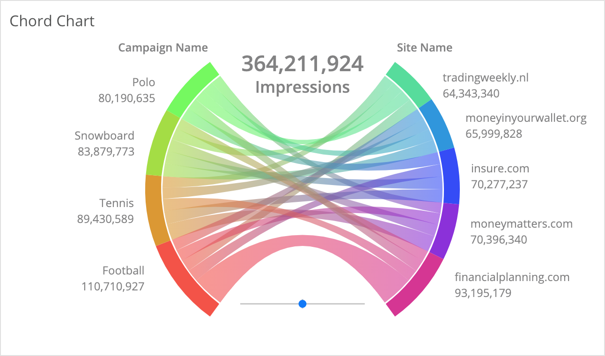

# datorama-d3-chord-chart
Custom widget for Datorama. Visualises weights of relationships between dimensions.

This custom widget creates a chord chart, with lines linking entities of two dimensions, sized by a metric. Hovering over the nodes will highlight all related links, and hovering over a link will highlight that link and show a tooltip with the specific number.



## Preferences
Add this code to the JS section of the Custom Widget Editor. The `colorScheme` attribute will accept the name of any gradient found on the [D3 color schemes gallery](https://observablehq.com/@d3/color-schemes), and will default to `Sinebow` for invalid choices.
```
var prefs = {
  'colorScheme': 'Sinebow', // Choose a scheme name from any of the gradients here https://observablehq.com/@d3/color-schemes
  'summable': true // true or false; affects summing and display of subtotals on the sides
};
```

## Common Style Changes
To change the style of text, use the below selectors in the CSS section of the Custom Widget Editor. All the usual text styles can be applied, such as `font-family`, `font-size`, `font-style`, `color`, etc.. The `#total` element is SVG, so use `fill` instead of `color`.
```
body {
  
}

.tooltip-value {
  
}

#total {
  
}
```
The size of the total can't be changed, as that is set to fill the available space.

## Set up and Dependencies
Add `chordChart.initialize();` to the JS section, and add the below links to the dependencies area (second button at the top left of the Custom Widget Editor).

Script dependencies (must be loaded in this order):
1. `https://d3js.org/d3.v6.min.js`
2. `https://dato-custom-widgets-js-css.s3.eu-west-2.amazonaws.com/chord-chart/Chord+Chart.js`

Style dependency:
1. `https://dato-custom-widgets-js-css.s3.eu-west-2.amazonaws.com/chord-chart/Chord+Chart.css`
